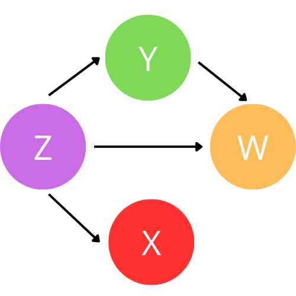

# Inferência Causal para Humanos



**Um guia prático para entender e aplicar inferência causal**

[](https://resolvedortech.com.br/inferencia-causal-para-humanos)
[](https://www.python.org/downloads/)
[](LICENSE)

## 📖 Sobre o Projeto

Este projeto é uma coleção de recursos, anotações e exemplos práticos em português sobre inferência causal. O objetivo é tornar conceitos complexos de causalidade mais acessíveis para estudantes, profissionais e entusiastas que desejam compreender como identificar e estimar relações causais.

A maioria dos recursos sobre inferência causal está em inglês e assume conhecimento avançado em estatística e matemática. Este material busca preencher essa lacuna, oferecendo:

- 📝 Explicações simplificadas e em português
- 💻 Exemplos práticos com Python
- 📊 Notebooks interativos com dados reais
- 🎯 Aplicações do mundo real
- 📚 Referências organizadas e comentadas

## 🚀 Acesso à Documentação

A documentação completa está disponível em:

**[https://resolvedortech.com.br/inferencia-causal-para-humanos](https://resolvedortech.com.br/inferencia-causal-para-humanos)**

## 📚 Conteúdo

### Fundamentos
- **Correlação e Causalidade**: Entenda a diferença fundamental entre associação e causalidade
- **Estatística**: Conceitos fundamentais de correlação e análise estatística
  - Teoria da correlação
  - Notebooks práticos com exemplos

## 🛠️ Tecnologias Utilizadas

- **Python 3.12+**: Linguagem principal para exemplos e análises
- **MkDocs Material**: Geração da documentação estática
- **Jupyter Notebooks**: Exemplos interativos
- **Bibliotecas principais**:
  - NumPy e Pandas: Manipulação de dados
  - Matplotlib e Seaborn: Visualização
  - SciPy: Análises estatísticas
  - SymPy: Matemática simbólica

## 💻 Desenvolvimento Local

### Pré-requisitos

- Python 3.12 ou superior
- uv (gerenciador de pacotes Python)

### Instalação

1. Clone o repositório:
```bash
git clone https://github.com/seu-usuario/inferencia-causal-para-humanos.git
cd inferencia-causal-para-humanos
```

2. Instale as dependências:
```bash
uv sync
```

3. Execute o servidor de documentação local:
```bash
mkdocs serve
```

4. Acesse no navegador:
```
http://127.0.0.1:8000/inferencia-causal-para-humanos/
```

## 📝 Como Contribuir

Contribuições são muito bem-vindas! Se você deseja:

- Corrigir erros
- Adicionar novos exemplos
- Melhorar explicações
- Sugerir novos tópicos

Por favor:

1. Faça um fork do projeto
2. Crie uma branch para sua feature (`git checkout -b feature/NovoTopico`)
3. Commit suas mudanças (`git commit -m 'Adiciona novo tópico sobre X'`)
4. Push para a branch (`git push origin feature/NovoTopico`)
5. Abra um Pull Request

## 👨‍💻 Autor

**Resolvedor Tech**

- Instagram: [@resolvedortech](https://www.instagram.com/resolvedortech/)
- LinkedIn: [Thiago Yuki](https://www.linkedin.com/in/thiagoyuki/)

## 📄 Licença

Este projeto está sob a licença MIT. Veja o arquivo [LICENSE](LICENSE) para mais detalhes.

## 🙏 Agradecimentos

Este material foi inspirado e construído com base nos excelentes trabalhos de:

- **Matheus Facure** - [Causal Inference for the Brave and True](https://matheusfacure.github.io/python-causality-handbook/)
- **Miguel Hernán** - [Causal Inference: What If](https://miguelhernan.org/whatifbook)
- **Scott Cunningham** - [Causal Inference: The Mixtape](https://mixtape.scunning.com/)
- **Paul R. Rosenbaum** - Diversos livros sobre desenho de estudos observacionais
- **Stefan Thomke** - A Cultura da Experimentação
- **Jos W. R. Twisk** - Analysis of Data from Randomized Controlled Trials

---

**© 2026 Resolvedor Tech | Todos os direitos reservados**

