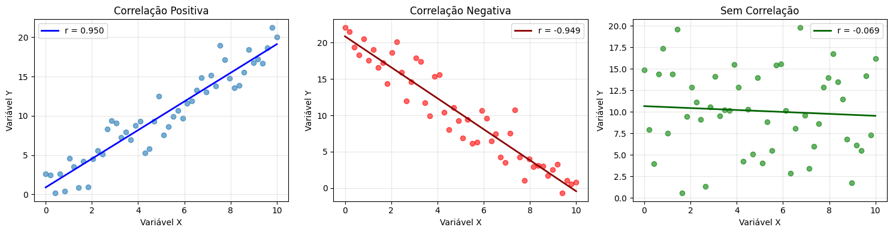

# Correlação

A correlação é uma medida estatística que indica a força e a direção de um relacionamento linear[^1] entre duas variáveis. 
Existem diferentes métodos para calcular a correlação entre variáveis, sendo o coeficiente de correlação de Pearson um dos mais comuns. Esse coeficiente é calculado usando a fórmula:

$$
r = \frac{\sum_{i=1}^{n}(x_i - \bar{x})(y_i - \bar{y})}{\sqrt{\sum_{i=1}^{n}(x_i - \bar{x})^2} \sqrt{\sum_{i=1}^{n}(y_i - \bar{y})^2}} 
$$

Ela é representada por um valor que varia de -1 a 1:

- Um valor de **1** indica uma correlação positiva perfeita, o que significa que quando uma variável aumenta, a outra também aumenta proporcionalmente.

- Um valor de **-1** indica uma correlação negativa perfeita, o que significa que quando uma variável aumenta, a outra diminui proporcionalmente.

- Um valor de **0** indica que não há correlação linear entre as duas variáveis, ou seja, mudanças em uma variável não estão associadas a mudanças na outra.

[^1]: Relacionamento linear é uma relação entre duas variáveis onde uma variável pode ser expressa como uma função linear da outra. Em outras palavras, quando uma variável aumenta ou diminui, a outra variável também tende a aumentar ou diminuir de forma proporcional.

